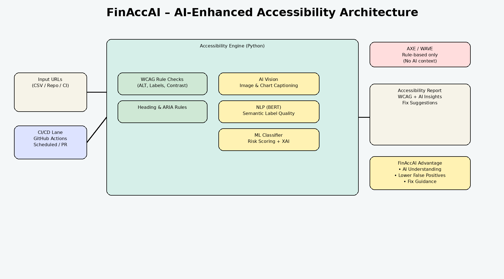

# Accessibility Testing Automation — FinAccAI

FinAccAI is a Python-based accessibility auditing prototype that performs automated, rule-based checks on websites to identify common WCAG-aligned accessibility issues. The tool is useful for QA engineers, accessibility auditors, and development teams who want a fast, lightweight assessment of baseline accessibility across one or more web applications.

[](https://github.com/hkrishnan62/Accessibility-2025/actions/workflows/scan.yml)

---
## Architecture Overview

## Key Capabilities ✅

- **Image accessibility** — detects `` elements with missing or empty `alt` attributes
- **Form accessibility** — identifies `<input>` elements without an associated `<label>`, `aria-label`, or `aria-labelledby`
- **Color contrast (inline styles)** — flags low contrast when inline CSS uses hex foreground/background colors (uses WCAG contrast ratio thresholds)
- **Heading structure validation** — detects skipped heading levels (e.g., `<h2>` followed directly by `<h4>`)
- **Multi-site scanning** — scan multiple URLs provided in a CSV file
- **Reporting** — generates a styled HTML report (`log/`) with summary metrics and per-site, per-category findings

---

## Intended Use Cases

- Accessibility smoke testing during development
- QA validation before accessibility audits
- Regression checks in CI/CD pipelines
- Early identification of WCAG-related risks
- Educational and research-oriented accessibility analysis

> ⚠️ Note: FinAccAI is a prototype. It performs rule-based, static HTML checks and does **not** replace manual testing with real assistive technologies.

---

## Prerequisites

- Python 3.7 or higher
- Python packages:
  - `requests`
  - `beautifulsoup4`

Install dependencies:

```bash
pip install requests beautifulsoup4
```

---

## How it works (high-level)

1. Reads a CSV file containing website URLs (expects a `url` column)
2. Fetches HTML for each URL
3. Applies rule-based accessibility checks
4. Aggregates findings across sites
5. Writes a timestamped HTML report to `log/`

---

## Input format

CSV must contain a column named `url`, for example:

```csv
url
https://example.com
https://another-site.com
```

---

## Running the tool

```bash
python finaccai.py --csv websites.csv
```

Output: a timestamped HTML report saved under `log/`, e.g. `log/accessibility_report_YYYY-MM-DD_HHMMSS.html`.

---

## CI/CD Compatibility

FinAccAI is CI-friendly and can be integrated into pipelines. This repository includes a GitHub Actions workflow (`.github/workflows/scan.yml`) that runs the scanner and uploads generated reports as workflow artifacts.

---

## Project status & scope

- Rule-based checks only (no headless browser or JS execution)
- Color contrast limited to inline CSS hex colors
- Static HTML analysis (no JS-rendered DOM at this time)
- Prototype / research focus

**Future enhancements (examples):** CSS file parsing, ARIA role validation, JavaScript DOM rendering support, accessibility scoring metrics.

---

## License & usage

This project is provided for research, education, and evaluation. Feel free to adapt and extend the framework for your own accessibility workflows.  

This project targets web developers, accessibility auditors, QA teams, or anyone who needs to quickly gauge accessibility compliance on a set of URLs.  

---

## 📄 Features & What It Checks

- Detects `` tags missing or having empty `alt` attributes  
- Identifies `<input>` fields without a corresponding `<label>` or `aria-label` / `aria-labelledby`  
- Detects inline-styled text elements with insufficient color contrast (hex colors only)  
- Checks for heading structure consistency: warns if heading levels are skipped (e.g., `<h1>` → `<h3>`)  
- Supports scanning multiple websites listed in a CSV file  
- Generates a clean, styled HTML report (saved under `log/`) with summary and per-site issue breakdown  

---

## 🧰 Prerequisites

- Python 3.7 or above  
- `requests` library  
- `beautifulsoup4` (bs4) library  

You can install required dependencies via:

```bash
pip install requests beautifulsoup4

