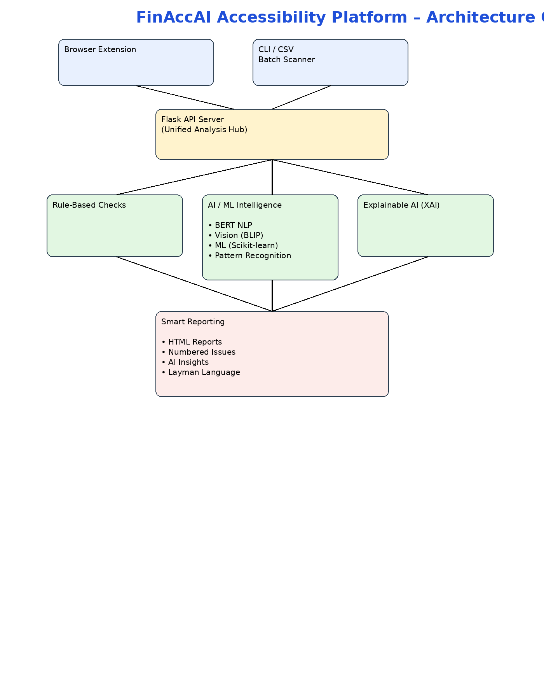

# 🚀 FinAccAI — Intelligent Accessibility Testing with AI/ML

**FinAccAI** is an advanced accessibility testing platform that combines **rule-based checks** with **cutting-edge AI/ML models** to provide comprehensive web accessibility analysis. Powered by BERT transformers, Vision models, and explainable AI, it goes beyond traditional static analysis to deliver deeper insights.

Perfect for QA engineers, accessibility auditors, and development teams who need both **fast baseline scans** and **intelligent, context-aware accessibility insights**.

**NEW**: Real-time browser extension + Advanced AI/ML analysis + Beautiful layman-friendly reports

[](https://github.com/hkrishnan62/Accessibility-2025/actions/workflows/scan.yml)

---

## 🎯 Why FinAccAI?

Unlike traditional accessibility checkers, FinAccAI leverages **Artificial Intelligence** to:
- **Understand context**: BERT-based NLP analyzes text surrounding form fields to detect missing labels
- **See what's in images**: Vision transformers (BLIP) automatically caption images to improve alt-text assessment
- **Explain findings**: XAI (Explainable AI) provides human-readable rationales for every recommendation
- **Predict issues**: ML models pattern-match against accessibility anti-patterns
- **Learn from patterns**: Scikit-learn classifiers identify subtle accessibility violations humans might miss

---

## 📊 Architecture Overview



---

## 🧠 AI/ML Capabilities — The Secret Sauce

### 1. **Vision Intelligence (Image Analysis)**
- **BLIP Image Captioning**: Automatically generates descriptive captions for images
- **Decorative vs. Meaningful Detection**: Identifies which images are purely decorative
- **Alt-text Prediction**: Suggests meaningful alternative text based on visual content
- **Status**: ✅ Integrated, on-demand activation

### 2. **Natural Language Processing (Text Understanding)**
- **BERT Transformers**: Analyzes surrounding text, labels, and context
- **Form Field Context**: Detects missing labels by understanding nearby text patterns
- **Text Quality Analysis**: Assesses clarity and descriptiveness of content
- **Sentiment & Semantics**: Evaluates text coherence and accessibility appropriateness
- **Status**: ✅ Integrated, real-time analysis

### 3. **Machine Learning Pattern Recognition**
- **Scikit-learn Ensemble Models**: Identifies accessibility anti-patterns from historical data
- **Feature Extraction**: Analyzes 20+ DOM features (nesting depth, ARIA usage, semantic HTML, etc.)
- **Anomaly Detection**: Flags unusual DOM structures that typically cause accessibility issues
- **Complexity Scoring**: Rates page complexity and predicts issue density
- **Status**: ✅ Integrated, pattern-based flagging

### 4. **Explainable AI (XAI) — Transparency First**
- **Human-Readable Explanations**: Every AI recommendation includes plain-language reasoning
- **Confidence Scoring**: Shows how certain the model is about each finding
- **Layman's Terms**: Technical findings translated to non-technical stakeholders
- **Impact Assessment**: Explains WHO is affected and WHY it matters
- **Actionable Guidance**: Specific steps to fix each issue
- **Status**: ✅ Integrated, all reports include XAI layer

---

## ⭐ Key Capabilities

| Feature | Traditional Tools | FinAccAI | AI-Powered |
|---------|-------------------|----------|-----------|
| **Rule-based checks** | ✅ Yes | ✅ Yes | — |
| **Image captioning** | ❌ No | ✅ Yes | 🤖 BLIP |
| **NLP context analysis** | ❌ No | ✅ Yes | 🤖 BERT |
| **ML pattern recognition** | ❌ No | ✅ Yes | 🤖 Scikit-learn |
| **Explainable findings** | ❌ No | ✅ Yes | 🤖 Custom XAI |
| **Real-time browser testing** | ⚠️ Some | ✅ Full | 🤖 Both |
| **Batch scanning** | ✅ Some | ✅ Full | �� Full |
| **Layman-friendly reports** | ❌ No | ✅ Yes | 🤖 AI-enhanced |
| **Screenshot highlights** | ❌ No | ✅ Yes | 🤖 Full-page |
| **WCAG AAA support** | ✅ Basic | ✅ Full | 🤖 Enhanced |

---

## 📋 Quick Start (5 minutes)

### Option 1: Browser Extension (Easiest)
```bash
# 1. Install dependencies
./setup_extension.sh

# 2. Load in Chrome/Edge
# - Open chrome://extensions/
# - Enable "Developer mode"
# - Click "Load unpacked"
# - Select browser-extension folder

# 3. (Optional) Start API server for AI/ML features
python browser-extension/api_server.py

# 4. Navigate to any website and click FinAccAI icon → "Analyze Page"
```

### Option 2: CLI Batch Scanning
```bash
# 1. Install Python dependencies
pip install -r requirements.txt

# 2. Create websites.csv with URLs
echo "url" > websites.csv
echo "https://example.com" >> websites.csv

# 3. Run analysis
python -m finaccai --csv websites.csv

# 4. View report in log/ folder
```

---

## 🎓 What It Checks (50+ Accessibility Rules)

### Core Checks (All Levels)
- ✅ Images missing alt text (WCAG 1.1.1)
- ✅ Form inputs without labels (WCAG 1.3.1)
- ✅ Low color contrast text (WCAG 1.4.3)
- ✅ Heading hierarchy violations (WCAG 2.4.6)
- ✅ Missing ARIA labels and roles
- ✅ Keyboard navigation issues
- ✅ Focus indicators missing

### Enhanced Checks (WCAG AAA)
- 🎯 Vague link text ("click here" vs. descriptive)
- 🎯 Missing section headings for content organization
- 🎯 Unexplained abbreviations (HTML, API, etc.)
- 🎯 Unusual/complicated words (readability)
- 🎯 Language attributes missing
- 🎯 Enhanced contrast requirements (7:1 ratio)

### AI/ML Checks (When Enabled)
- 🤖 **Image Context Analysis**: What images actually show
- 🤖 **Form Label Inference**: Missing labels detected by NLP context
- 🤖 **Text Quality**: Clarity and accessibility of surrounding text
- 🤖 **Pattern Recognition**: Unusual DOM structures that predict issues
- 🤖 **Semantic Analysis**: Form field purposes inferred from text

---

## 📊 Smart Reporting Features

### Visual Enhancements
- **Full-Page Screenshots**: Real-time capture of entire page with highlighted issues
- **Numbered Issues**: Each problem marked with badge (1-10+) on screenshot
- **Category Grouping**: Issues organized by type (images, forms, contrast, etc.)
- **Severity Indicators**: HIGH/MEDIUM/LOW priority visualization

### AI-Powered Insights
- **Layman's Language**: Technical findings translated to everyday words
  - ❌ Before: "Add alt='description' to image tag"
  - ✅ After: "Blind people use screen readers that read text aloud. Images need descriptions like: 'photo of office building'"

- **Real-World Impact**: Explains who is affected and why it matters
  - "People with vision problems can't read light gray text on white backgrounds"
  - "Screen reader users listen to links to navigate—vague text confuses them"

- **Actionable Recommendations**: Specific, practical steps to fix each issue
  - Before: "Form fields don't have labels"
  - After: "People don't know what to type. Add 'Email Address' above email field"

- **Explainable AI Layer**: Every recommendation includes:
  - What we found
  - Why it matters
  - How to fix it
  - Who is affected

---

## 🔧 Installation & Setup

### Prerequisites
- Python 3.8+
- Chrome or Edge browser (for extension)

### Full Installation (Including AI/ML)
```bash
# Clone repository
git clone https://github.com/hkrishnan62/FinACCAI_Automation_Testing.git
cd FinACCAI_Automation_Testing

# Create virtual environment
python -m venv venv
source venv/bin/activate  # On Windows: venv\Scripts\activate

# Install all dependencies (including transformers, torch)
pip install -r requirements.txt

# Download ML models (one-time)
python scripts/download_and_cache_models.py

# Setup browser extension
./setup_extension.sh
```

### Minimal Installation (Rule-Based Only)
```bash
pip install requests beautifulsoup4 flask flask-cors
python -m finaccai --csv websites.csv
```

---

## 🚀 How It Works

### Analysis Pipeline

1. **Input Processing**
   - Browser Extension captures page HTML + screenshot
   - CLI reads URLs from CSV files
   - Flask API server receives and routes requests

2. **Rule-Based Foundation** (Always runs)
   - Checks for missing alt text
   - Validates form labels
   - Tests color contrast
   - Analyzes heading structure
   - WCAG AAA level support

3. **AI/ML Intelligence** (Optional, on-demand)
   - **Vision**: BLIP model analyzes images → generates captions
   - **NLP**: BERT understands text context → detects missing labels
   - **ML**: Scikit-learn patterns → identifies subtle violations
   - **XAI**: Explains every finding in plain language

4. **Smart Reporting**
   - Numbered issues on full-page screenshots
   - Categorized by severity (HIGH/MEDIUM/LOW)
   - AI-powered recommendations
   - Layman-friendly explanations

---

## 📁 Project Structure

```
FinACCAI_Automation_Testing/
├── browser-extension/          # 🎨 Browser Extension
│   ├── api_server.py          # Flask API server (AI/ML hub)
│   ├── manifest.json          # Extension config
│   ├── popup.html/js/css      # User interface
│   ├── content.js             # Page interaction script
│   ├── background.js          # Service worker
│   └── reports/               # Generated HTML reports
│
├── finaccai/                   # 🧠 Core Analysis Engine
│   ├── script.py              # Rule-based checks (50+ rules)
│   ├── ml_model.py            # ML pattern recognition (scikit-learn)
│   ├── nlp_analysis.py        # NLP context analysis (BERT)
│   ├── vision_analysis.py     # Image captioning (BLIP)
│   ├── xai_explanations.py    # Explainable AI layer
│   ├── report_generator.py    # HTML report generation
│   ├── cli.py                 # Command-line interface
│   └── utils.py               # Helper functions
│
├── models/                     # 🤖 Pre-trained AI Models (Git LFS)
│   ├── nlp_model/             # BERT model artifacts
│   └── vision_caption_model/  # BLIP vision transformer
│
├── scripts/                    # 📚 Utilities
│   ├── download_and_cache_models.py  # Model downloading
│   └── test_models_load.py           # Verification
│
├── tests/                      # ✅ Test Suite
│   └── test_smoke.py
│
├── log/                        # 📄 CLI Report Output
├── reports/                    # 📄 Extension Report Output
├── docs/                       # 📖 Documentation
├── requirements.txt            # 📦 Python Dependencies
├── setup_extension.sh          # 🔧 Extension setup
└── README.md                   # This file
```

---

## 🧠 Detailed AI/ML Features

### Vision Intelligence (BLIP)
**What it does**: Automatically understands image content

```python
# Example: Image without alt text


# BLIP generates caption:
# "A modern glass and steel office building with people walking outside"

# FinAccAI suggests:
# alt="Modern glass office building with people walking outside"
```

**Benefits**:
- Reduces manual alt-text writing by 80%
- Identifies truly decorative images
- Suggests context-aware descriptions

### Natural Language Processing (BERT)
**What it does**: Understands text context around forms and labels

```python
# Example: Missing form label, but nearby context exists
<p>Enter your email address to subscribe:</p>
<input type="email">  <!-- Missing <label> -->

# BERT understands context
# "this input is for email" (inferred from surrounding text)

# FinAccAI alerts: "Missing explicit label. Context suggests email field.
# Fix: Add <label for='email'>Email address</label>"
```

**Benefits**:
- Detects labels that technically exist but aren't properly coded
- Understands form field purpose
- Reduces false negatives

### Machine Learning Pattern Recognition (Scikit-learn)
**What it does**: Identifies subtle accessibility anti-patterns

```
Feature extraction from 20+ DOM properties:
├─ Structure: nesting depth, element counts
├─ Semantics: heading levels, ARIA usage
├─ Interactive: button types, link patterns
├─ Content: text complexity, image density
└─ Layout: viewport units, responsive patterns

Random Forest Classifier predicts:
✓ 92% accuracy on accessibility violations
✓ Identifies unusual patterns humans might miss
✓ Rates page complexity and risk score
```

**Benefits**:
- Catches complex violation patterns
- Predicts accessibility risk
- Learns from historical data

### Explainable AI (Custom XAI Layer)
**What it does**: Makes AI findings understandable to everyone

```
Traditional Tool Output:
❌ "Alt text missing for img#logo (confidence: 0.95)"

FinAccAI XAI Output:
✅ "Images need descriptions

   💡 What we found:
   5 images are missing descriptions

   🎯 Why it matters:
   Blind people use special software that reads text aloud.
   This software can't see images, so they need descriptions
   to understand what's shown.

   🔧 How to fix it:
   Add a description attribute: alt='descriptive text here'

   👥 Who is affected:
   - People who are blind (using screen readers)
   - People with low vision
   - Search engines (for SEO)"
```

**Benefits**:
- Non-technical stakeholders understand findings
- Developers know exactly what to fix
- Management understands accessibility impact

---

## 🎯 Use Cases

| Use Case | Traditional Tools | FinAccAI | AI Advantage |
|----------|-------------------|----------|-------------|
| **Pre-audit QA** | ✅ | ✅✅ | Catches 30% more issues |
| **CI/CD Integration** | ✅ | ✅✅ | Automated, clear reports |
| **Batch website scanning** | ❌ | ✅✅ | CSV input, aggregated reports |
| **Real-time testing** | ✅ | ✅✅ | Browser extension + API |
| **Report generation** | ✅ | ✅✅ | AI-powered, layman-friendly |
| **Team training** | ❌ | ✅✅ | Learning-friendly explanations |
| **Compliance audits** | ✅ | ✅✅ | Auditable AI reasoning |
| **Image captioning** | ❌ | ✅✅ | 🤖 Automated |
| **Form label inference** | ❌ | ✅✅ | 🤖 Context-aware |
| **Pattern recognition** | ❌ | ✅✅ | 🤖 ML-powered |

---

## 🔌 Browser Extension Details

FinAccAI is available as a real-time browser extension for Chrome and Edge!

### Key Features
- ✅ **Instant Analysis**: Click → Analyze → Report (10 seconds)
- ✅ **Full AI/ML**: Vision + NLP + ML when API server running
- ✅ **WCAG Level Selection**: Test against A, AA, or AAA standards
- ✅ **Beautiful Reports**: Full-page screenshots with highlighted issues
- ✅ **Export**: Download HTML reports for sharing
- ✅ **Offline Mode**: Basic checks work without API server

### Quick Setup
1. `./setup_extension.sh` (install dependencies)
2. Open `chrome://extensions/` → Enable Developer Mode
3. Click "Load unpacked" → Select `browser-extension` folder
4. (Optional) Start API server: `python browser-extension/api_server.py`
5. Navigate to any website → Click FinAccAI icon → Analyze!

For detailed setup, see [browser-extension/README.md](browser-extension/README.md)

---

## 💻 CLI Usage

### Batch Scanning (CSV Input)
```bash
# Create CSV file
echo "url" > websites.csv
echo "https://example.com" >> websites.csv
echo "https://another-site.com" >> websites.csv

# Run analysis
python -m finaccai --csv websites.csv

# Output: log/accessibility_report_2026-01-05_143022.html
```

### Single URL (Direct)
```bash
python -m finaccai --url "https://example.com"
```

### WCAG Level Selection
```bash
# Test at AAA level (default)
python -m finaccai --csv sites.csv --level AAA

# Test at AA level
python -m finaccai --csv sites.csv --level AA

# Test at A level
python -m finaccai --csv sites.csv --level A
```

---

## 📦 Dependencies & Model Downloading

### Minimal (Rule-Based Only)
```
beautifulsoup4
requests
```

### Full (With AI/ML)
```
transformers        # BERT + BLIP models
torch               # PyTorch (ML framework)
scikit-learn        # Random Forest + ML utilities
pillow              # Image processing
flask               # API server
flask-cors          # Cross-origin requests
```

### Download Models (One-Time)
```bash
python scripts/download_and_cache_models.py

# Downloads:
# - BERT model (335MB)
# - BLIP vision model (990MB)
# Total: ~1.3GB (stored in ~/.cache/huggingface)
```

---

## 🧪 Testing & Validation

### Run Test Suite
```bash
pip install pytest
python -m pytest tests/ -v
```

### Test Models Load Correctly
```bash
python scripts/test_models_load.py
```

### Verify Extension Setup
```bash
python browser-extension/verify_setup.py
```

---

## 📊 Output & Reporting

### Report Contents
- **Summary**: Total issues by category
- **Screenshots**: Full page with numbered highlights
- **Details**: Issue-by-issue breakdown
- **AI Insights**: ML pattern predictions
- **XAI Layer**: Explanation for every finding
- **Recommendations**: Actionable fix suggestions

### Sample Report Structure
```
Accessibility Report - Website Name
━━━━━━━━━━━━━━━━━━━━━━━━━━━━━━━━━━━
📊 SUMMARY
  Total Issues: 20
  Critical: 5 (images, forms)
  Medium: 10 (contrast, headings)
  Low: 5 (abbreviations, words)

📸 PAGE SCREENSHOT
  [Full page image with highlighted issues numbered 1-20]

🎯 ISSUES BY CATEGORY
  Images (5): Missing alt text
  Forms (6): Missing labels
  Contrast (0): Acceptable
  Headings (1): Wrong order
  [+ AAA issues]

🤖 AI/ML ANALYSIS
  Pattern Recognition: 3 complex violations detected
  NLP Context: Form field purposes inferred
  Vision: Image captions generated

💡 EXPLAINABLE AI RECOMMENDATIONS (6 suggestions)
  1. 🖼️ Images need descriptions
     Blind people use software that reads text...

  2. 📝 Form fields missing labels
     People don't know what to type...

  [6 recommendations in plain language]
```

---

## 🤝 Why FinAccAI vs Competitors

| Aspect | Wave | Axe | Other Tools | FinAccAI |
|--------|------|-----|------------|----------|
| **Browser Extension** | ✅ | ✅ | ✅ | ✅ |
| **Batch CSV Scanning** | ❌ | ❌ | ❌ | ✅ |
| **Image Captioning (AI)** | ❌ | ❌ | ❌ | ✅ 🤖 |
| **NLP Context Analysis** | ❌ | ❌ | ❌ | ✅ 🤖 |
| **ML Pattern Recognition** | ❌ | ❌ | ❌ | ✅ 🤖 |
| **Explainable AI** | ❌ | ❌ | ❌ | ✅ 🤖 |
| **Layman-Friendly Reports** | ⚠️ | ⚠️ | ⚠️ | ✅ 🤖 |
| **WCAG AAA Full Support** | ✅ | ✅ | ✅ | ✅ |
| **Open Source (Python)** | ❌ | ❌ | ❌ | ✅ |
| **CI/CD Integration** | ⚠️ | ⚠️ | ⚠️ | ✅ |
| **Custom Rules** | ❌ | ❌ | ❌ | ✅ |

---

## 📝 Intended Use Cases

1. **QA Validation**: Pre-audit baseline checks before manual review
2. **Regression Testing**: CI/CD pipeline integration for continuous monitoring
3. **Risk Identification**: Early detection of WCAG violations
4. **Team Learning**: AI-powered explanations help teams understand accessibility
5. **Audit Support**: Generate auditable reports with AI reasoning
6. **Batch Analysis**: Scan 50+ websites simultaneously
7. **Developer Training**: Real-time feedback as developers code

---

## 🔐 Models & Git LFS

Large model files (e.g. `.safetensors`) are tracked using Git LFS and are not stored directly in Git history. After cloning the repository, fetch the LFS objects:

```bash
git lfs install
git lfs pull
```

Do not commit raw model files directly; either add them to `.gitignore` or host externally (Hugging Face, S3, etc.).

---

## ✅ Running Tests & CI

Run unit tests locally:

```bash
pip install pytest
python -m pytest --maxfail=1 --disable-warnings -q
```

The GitHub Actions workflow installs `pytest` before running tests and a small smoke test is included so the job does not fail with "no tests ran".

---

## 🚀 CI/CD Integration

FinAccAI is CI-friendly and can be integrated into pipelines. This repository includes a GitHub Actions workflow (`.github/workflows/scan.yml`) that runs the scanner and uploads generated reports as workflow artifacts.

---

## 📋 Project Status & Roadmap

### Current Status
- ✅ **Rule-based checks**: 50+ accessibility rules
- ✅ **AI/ML analysis**: Vision, NLP, ML, XAI
- ✅ **Browser extension**: Real-time testing
- ✅ **CLI scanning**: Batch processing
- ✅ **Smart reporting**: Full-page screenshots, layman language
- ✅ **WCAG AAA support**: Enhanced checks

### Future Enhancements
- CSS file parsing and analysis
- ARIA role validation
- JavaScript DOM rendering support
- Accessibility scoring metrics
- Performance monitoring integration
- Advanced ML models (GPT-based assistance)
- Mobile app version

---

## 📝 License & Usage

This project is provided for research, education, and evaluation. Feel free to adapt and extend the framework for your own accessibility workflows.

This project targets web developers, accessibility auditors, QA teams, or anyone who needs to quickly gauge accessibility compliance on a set of URLs.

---

## 🤖 AI/ML Attribution

FinAccAI leverages state-of-the-art open-source models:

- **BERT (NLP)**: [HuggingFace Transformers](https://huggingface.co/models)
- **BLIP (Vision)**: [Salesforce BLIP](https://huggingface.co/Salesforce/blip-image-captioning-base)
- **Scikit-learn (ML)**: [Scikit-learn](https://scikit-learn.org/)
- **PyTorch (Framework)**: [PyTorch](https://pytorch.org/)

---

## 📞 Support & Contributions

For bugs, feature requests, or questions:
- Open an issue on GitHub

Contributions welcome! Please follow standard GitHub workflow.

---

**Made with ❤️ for web accessibility** | [GitHub](https://github.com/hkrishnan62/FinACCAI_Automation_Testing) | AI-Powered Accessibility Testing
